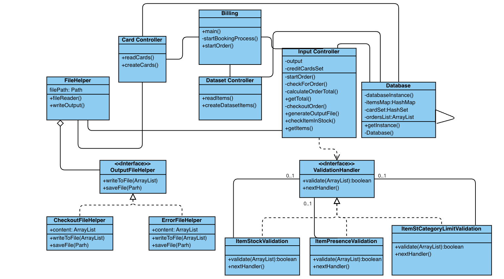
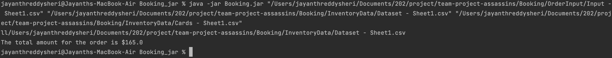
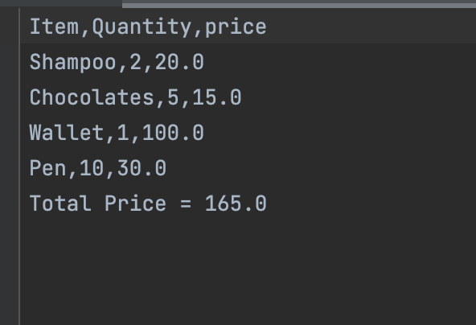
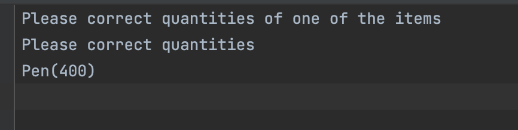

# individual-project-jaysheri
individual-project-jaysheri-1 created by GitHub Classroom

# individual-project-jaysheri
individual-project-jaysheri-1 created by GitHub Classroom

# Billing System
###Submitted by-
Jayanth Reddy Sheri
015242565

## Instructions to run project:
- To run the code, you'll need the Intellij IDE and Java 8.
- Build the artifacts and a jar file will be generated in the out folder.
- In command line, go to the path where the jar file is present
- Run the following command in the command prompt: `java -jar <jar_name> "<Order Information File Path>” ”<Card Information File Path>" “<Dataset File Path>"`

## Class Diagram:

## Design Patterns used:
- Chain of Responsibility
- Factory
- Singleton

## Chain of Responsibility:

It's a behavioral design pattern that lets you to route requests through a series of handlers. When a request arrived, each handler choose whether to process it or pass it over to the next handler in the chain.

This design pattern was utilized to assess whether or not the order could be handled appropriately. This pattern makes use of the following files:
Interface ValidationHandler 
- Class ItemPresenceValidation 
- Class ItemStockLimitValidation 
- Class ItemCategoryLimitValidation

Before determining if the order can be handled, a ValidationHandler object is generated and passed from one Handler to the next.

## Factory:

When an order is processed, we utilize this pattern to output. This pattern's implementation includes the following files:
Interface OutputFile
Class ErrorFile 
Class CheckoutFile
 
We'll build an instance of OutputFile when the concrete handler determines whether the outputs should be a checkout or error file. The FileReader class is used in the program to read and write files.

## Singleton:

This pattern is being used to create the application's database. This design only makes use of the Database class.

The getInstance() function is called whenever a database instance is required, ensuring that just one instance of such object is reused.

## Input:

## Output Success:

## Output Error:

